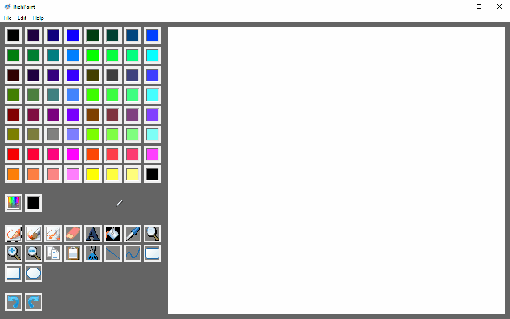

A mimic of Paint of Win10, I wanna make it more powerful like Notepad++.
Not only paint, but also powerful operations like typing text, insert picture, make gif, etc.
There're a lot to do...

# screenshot

# gif

# TODO
- [ ] Add text frame, user can type text into the text frame
- [ ] Screen clip
- [ ] Scamble
- [ ] insert picture(mainly about bitmap) into canvas, save canvas as bitmap
- [ ] save the entire file